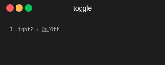

# Enquirer

[](https://github.com/Gashmob/Enquirer/actions/workflows/test.yml)

A collection of function to make an interactive CLI. Inspired by [Enquirer.js](https://www.npmjs.com/package/enquirer).

**Full demo**


- [Installation](#installation)
- [Usage](#usage)
    - [Auth](#auth)
    - [Autocomplete](#autocomplete)
    - [Confirm](#confirm)
    - [Form](#form)
    - [Input](#input)
    - [Invisible](#invisible)
    - [List](#list)
    - [MultiSelect](#multiselect)
    - [Number](#number)
    - [Password](#password)
    - [Quiz](#quiz)
    - [Slider](#slider)
    - [Select](#select)
    - [Toggle](#toggle)
- [Tests](#tests)

Have use [Terminalizer](https://github.com/faressoft/terminalizer) to record the demo.

## Installation

This library is a header only, so you can just add the header (`include/enquirer/enquirer.hpp`) in your project.

For example if you use a `CMakeLists.txt`, copy `include` dir in your project and add this to your `CMakeLists.txt`:

```cmake
add_executable(<target>
        ...
        include/enquirer/enquirer.hpp)

target_include_directories(<target> PUBLIC include)
```

So now, you can just add `#include <enquirer/enquirer.hpp>` in your source files.

## Usage

Please note :

- All functions are in the `enquirer` namespace.
- All functions are synchronous (wait until user submit).

You can try the demo by building the `demo` target.

### Auth

Ask the user for username and password.

**Prototypes**

There is 2 prototypes :

1. Returns the username and password as a `std::pair`
2. Takes a predicate as arguments and return its result.

```c++
std::pair<std::string, std::string> auth(const std::string &id_prompt = "Username",
                                         const std::string &pw_prompt = "Password",
                                         char mask = '*');

bool auth(const std::function<bool(const std::pair<std::string, std::string> &)> &predicate,
          const std::string &id_prompt = "Username",
          const std::string &pw_prompt = "Password",
          char mask = '*');
```

**Example**

```c++
bool is_valid = enquirer::auth([](const std::pair<std::string, std::string> &credentials) {
    return credentials.first == "admin"
           && credentials.second == "admin";
});
```

**Result**


### Autocomplete

Prompt the question and autocomplete the answer with a list of choices.

**Prototype**

```c++
std::string autocomplete(const std::string& question,
                         const std::string choices[] = {},
                         int limit = 10);
```

**Example**

```c++
std::string answer = enquirer::autocomplete("What is you favorite fruit", {
    "Apple",
    "Banana",
    "Blueberry",
    "Cherry",
    "Orange",
    "Pear",
    "Raspberry",
    "Strawberry"
});
```

**Result**


### Confirm

Ask the user to confirm.

**Prototype**

```c++
bool confirm(const std::string &question,
             bool default_value = false);
```

**Example**

```c++
bool quit = false;
while (!quit) {
    quit = enquirer::confirm("Do you want to quit?");
}
```

**Result**


### Form

Multi-prompt for user

**Prototype**

```c++
std::map<std::string, std::string> form(const std::string &question,
                                        const std::vector<std::string> &inputs);
```

**Example**

```c++
auto answers = enquirer::form("Please provide some informations:", {
        "Firstname",
        "Lastname",
        "Username"
});
```

**Result**


### Input

Prompt the question and return the answer.

**Prototype**

```c++
std::string input(const std::string &question,
                  const std::string &default_value = "");
```

**Example**

```c++
std::string answer = enquirer::input("What is your name?", "John Doe");
```

**Result**


### Invisible

Hides the user input

**Prototype**

```c++
std::string invisible(const std::string &question);
```

**Example**

```c++
std::string secret = enquirer::invisible("What is your secret?");
```

**Result**


### List

Same as [Input](#input), but split the user input around `,`.

**Prototype**

```c++
std::vector<std::string> list(const std::string &question);
```

**Example**

```c++
auto keywords = enquirer::list("Type comma separated keywords");
```

**Result**


### MultiSelect

Allow user to select several items from a list

**Prototype**

```c++
std::vector<std::string> multi_select(const std::string &question,
                                      const std::vector<std::string> &choices);
```

**Example**

```c++
auto choices = enquirer::multi_select("Choose some colors", {
    "Red",
    "Green",
    "Blue",
    "Yellow",
    "Magenta",
    "Cyan",
    "White",
    "Black"
});
```

**Result**


### Number

Ask the user for a number

**Prototype**

```c++
template<typename N,
        typename = typename std::enable_if<std::is_arithmetic<N>::value>::type>
N number(const std::string &question);
```

**Example**

```c++
auto pi = enquirer::number<double>("What is the value of PI?");
```

**Result**


### Password

Mask the user input with `*`.

**Prototype**

```c++
std::string password(const std::string &question,
                     char mask = '*');
```

**Example**

```c++
auto pwd = enquirer::password("What is your password?");
```

**Result**


### Quiz

Multi-choice quiz !

**Prototype**

```c++
bool quiz(const std::string &question,
          const std::vector<std::string> &choices,
          const std::string &correct);
```

**Example**

```c++
if (enquirer::quiz("Which is yellow?", {"Banana", "Coconut", "Strawberry"}, "Banana"))
    std::cout << "Good answer!" << std::endl;
else
    std::cout << "Bad answer!" << std::endl;
```

**Result**


### Slider

Allow user to choose a value in a range.

**Prototype**

```c++
template<typename N,
        typename = typename std::enable_if<std::is_arithmetic<N>::value>::type>
N slider(const std::string &question,
         N min_value,
         N max_value,
         N step,
         N initial_value);
```

**Example**

```c++
int value = enquirer::slider<int>("How much do you want?", 0, 10, 1, 1);
```

**Result**


### Select

Choose one item from a list.

**Prototype**

```c++
std::string select(const std::string &question,
                   const std::vector<std::string> &choices);
```

**Example**

```c++
auto language = enquirer::select("Which is the best one?", {
        "c++",
        "python",
        "java"
});
```

**Result**


### Toggle

Choose between two values.

**Prototype**

```c++
bool toggle(const std::string &question,
            const std::string &enable,
            const std::string &disable,
            bool default_value = false);
```

**Example**

```c++
bool light = enquirer::toggle("Light?", "On", "Off", true);
```

**Result**



## Tests

All tests are run for each push via [GitHub Actions](https://github.com/Gashmob/Enquirer/actions) on Ubuntu and macOS.
The tests sources are located in `tests/test.cpp` and use
a [simple c++ test framework](https://github.com/Gashmob/Cpp-Tests). You can run the tests by building the `test`
target.

